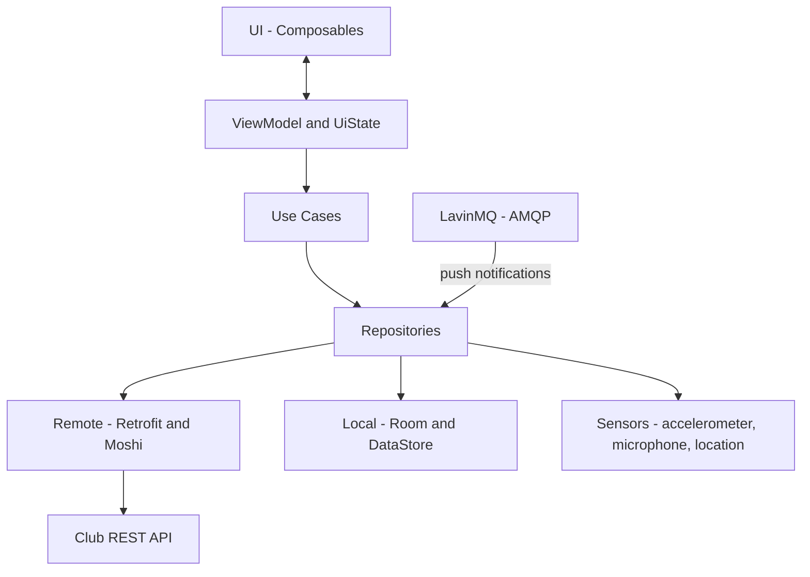

<div align="center">

# 🥋 ShinKai: Karate Club App

**A mobile companion app for members of a Shinkempo karate club, built with Kotlin and Jetpack Compose.**

<p>
  
  
  
  
  
  
  
</p>

[Download the APK](https://appdistribution.firebase.dev/i/b0d43bfb2c9e44fe)

</div>

> 🥋 Made for my own karate club, to track techniques, katas and training across belt levels.

## 📑 Table of Contents

- [📖 About](#about)
- [🏗️ Architecture](#architecture)
- [✨ Features](#features)
- [📱 Screens](#screens)
- [🛠️ Tech Stack](#tech-stack)
- [🚀 Getting Started](#getting-started)
- [📄 License](#license)
- [👤 Author](#author)

## 📖 About

- ShinKai is an Android app for members of a Shinkempo karate club.
- It lets you track your training, keep up with club events, study techniques per belt and measure your progress with built-in strength tests.
- The app is written in Kotlin with Jetpack Compose and follows an MVVM architecture with use cases and repositories.
- It talks to a club backend over an SSL-pinned REST API and receives live updates through a message broker.

## 🏗️ Architecture



## ✨ Features

**📅 Events**

- Swipeable monthly calendar with an inbox for unanswered RSVPs.
- RSVP to events, open the location in your maps app, or add the event to your calendar.
- Reminders for upcoming events and trainings, with a configurable lead time.
- Geofencing: arriving at an event prompts you to log your attendance.

**🏋️ Training**

- Training history with a calendar view and per-training notes.
- Technique and kata overview per belt level.
- Searchable Japanese–Dutch lexicon.

**💪 Strength tests**

- Punch force, measured with the accelerometer.
- Kiai volume, measured in dB with the microphone.
- Best scores saved per belt.

**🗺️ Map**

- Mapbox map with your live position, event markers and dojo zones.
- Turn-by-turn navigation to an event.

**👤 Profile and settings**

- Belt display, profile picture (camera or gallery) and editable account details.
- Customisable home screen shortcuts.
- Per-type notification toggles, plus light and dark theme.

**🔔 Live updates**

- Push notifications over a LavinMQ (AMQP) message broker, filtered by your notification settings.

## 📱 Screens

| Area | Screens |
| --- | --- |
| Main tabs | Home, Events, Kaart (map), Technieken, Profiel |
| Events | Event detail, Manage events |
| Learning | Techniques, Kata list, Lexicon |
| Progress | Training history, Strength tests (punch force, kiai) |
| Settings | Account, Notifications, Location |
| Auth | Login |

## 🛠️ Tech Stack

| Area | Technologies |
| --- | --- |
| Language | Kotlin |
| UI | Jetpack Compose, Material 3 |
| Architecture | MVVM, UiState, Use Cases, Repositories, Hilt |
| Networking | Retrofit + Moshi, SSL-pinned REST API |
| Local storage | Room, Preferences DataStore |
| Security | Android Keystore (AES-256-GCM) encrypts the JWT access token |
| Background work | WorkManager, foreground service |
| Messaging | LavinMQ via AMQP (consumer and publisher) |
| Maps and location | Mapbox (Maps + Navigation SDK), GPS, Geofencing API |
| Sensors | Accelerometer, microphone, camera |
| Testing | JUnit + MockK unit tests, instrumented Room DAO tests |
| Build tool | Gradle (Kotlin DSL) |
| CI/CD | Firebase App Distribution |

## 🚀 Getting Started

### Install the app

The quickest way to try the app is to [download the APK](https://appdistribution.firebase.dev/i/b0d43bfb2c9e44fe) through Firebase App Distribution.

### Build from source

#### Prerequisites

- [Android Studio](https://developer.android.com/studio)
- A JDK supported by your Android Studio version
- An Android device or emulator
- A Mapbox account for the Maps and Navigation SDK tokens

#### Clone

```bash
git clone https://github.com/MriceDK/Shinkai-Karate-App.git
cd Shinkai-Karate-App
```

---

## Configuration

Before building the app, make sure the following Gradle properties are set:

| Property | Purpose | Where it is used |
|---|---|---|
| `AMQPusername` | LavinMQ / AMQP username | `app/build.gradle.kts` -> `BuildConfig.AMQP_USERNAME` |
| `AMQPpassword` | LavinMQ / AMQP password | `app/build.gradle.kts` -> `BuildConfig.AMQP_PASSWORD` |
| `AMQPurl` | LavinMQ host, optionally with port | `app/build.gradle.kts` -> `BuildConfig.AMQP_URL` |
| `AMQPvhost` | LavinMQ virtual host | `app/build.gradle.kts` -> `BuildConfig.AMQP_VHOST` |
| `AMQPexchange` | LavinMQ exchange name | `app/build.gradle.kts` -> `BuildConfig.AMQP_EXCHANGE` |
| `MAPBOX_PUBLIC_TOKEN` | Public Mapbox token for the Maps SDK | `app/build.gradle.kts` -> `BuildConfig.MAPBOX_PUBLIC_TOKEN` |
| `MAPBOX_ACCESS_TOKEN` | Private Mapbox token for the Mapbox Maven repository and the app BuildConfig | `settings.gradle.kts` and `app/build.gradle.kts` -> `BuildConfig.MAPBOX_ACCESS_TOKEN` |
| `API_BASE_URL` | REST API base URL | `app/build.gradle.kts` -> `BuildConfig.API_BASE_URL` |

The project reads these values from `gradle.properties` by default, and CI can override them with `-P` flags. `local.properties` should remain machine-specific and is only used for local Android SDK settings.

Example entries:

```properties
AMQPusername=your-amqp-username
AMQPpassword=your-amqp-password
AMQPurl=your-lavinmq-host
AMQPvhost=your-vhost
AMQPexchange=your-exchange
MAPBOX_PUBLIC_TOKEN=your-mapbox-public-token
MAPBOX_ACCESS_TOKEN=your-mapbox-access-token
API_BASE_URL=https://your-api.example.com/api/v1/
```
#### Run

Open the project in Android Studio and run the `app` module on a device or emulator, or build from the command line:

```bash
./gradlew assembleDebug
```

#### Test

```bash
./gradlew test
```

Instrumented Room DAO tests need a connected device or emulator:

```bash
./gradlew connectedAndroidTest
```

## 📄 License

This project is licensed under the [Apache License 2.0](LICENSE).

## 👤 Author

| Name | GitHub | LinkedIn |
| --- | --- | --- |
| Maurice De Kegel | [MriceDK](https://github.com/MriceDK) | [LinkedIn](https://www.linkedin.com/in/dekegelmaurice/) |
